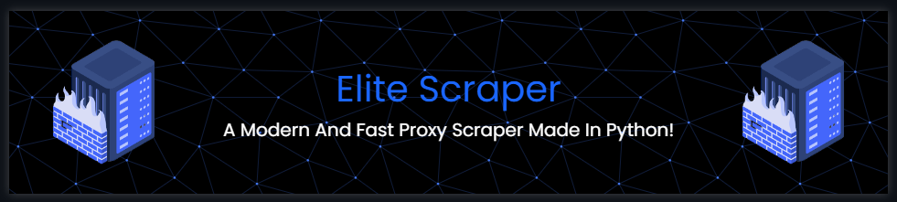

  <b>📰 Follow me here 📰</b>   
  <a href="https://discord.com/users/1032874064731185152">Discord</a> |
  <a href="https://www.youtube.com/channel/UCwq6NcsqT8PS8ixhhUjM9ZQ">YouTube</a> |
  <a href="https://github.com/marl0nx">Github</a>  

A Modern And Fast Proxy Scraper Made In Python!

<h3>Installation</h3>

- #### 🖥️ Getting started
      1 - Download the latest version.
      2 - Run the installation.bat file to install all requirements.
      3 - Edit the config.json file.
      4 - Run the main.py file and enjoy.
      
- #### ⚙ Configuration
      - "version": 1.1 | Don't change it or program will maybe stop working.
      - "show_dead_proxies": false | Print not workng proxies in console.
      - "threads": 25 | Set the thread amount the program should work with. More != better.
      - "timeout": 1000 | Set the timeout for the proxy check in ms (more = slower but more proxies).
      - "output_path": "output/proxies.txt" | Set the output path for the proxies.
      - "delete_old_proxies_in_file": true | Delete the old proxies in the proxy file.
      You can also add more urls to the urls.txt file (only ip:port format until now).

<h3>About The Project</h3>

- #### ⚙ Developers
      - Marl0nX | Discord: Marl0nX#2122
 
- #### ⚙ The Idea Behind This Project
      This Project started as a hobby and will always be a hobby of mine.
      I needed proxies for another project so I made my own proxy scraper because every scraper I tried wasn't good enough.
      I will continue the project as long as possible. If you have any wishes just open an issue here on Github.
      I will take a look at it and maybe I will add the feature in the future.
      Also if you like my work I would be greatful if you star this project <3
      Have a nice day my friend!
      

<h3>DISCLAIMER</h3>

I am not responsible for any damages done with this tool. It's made for educational purposes only!

<h3>Contact</h3>

- #### 📟 Discord
      Marl0nX#2122

- #### 📧 E-Mail
      Soon ..
